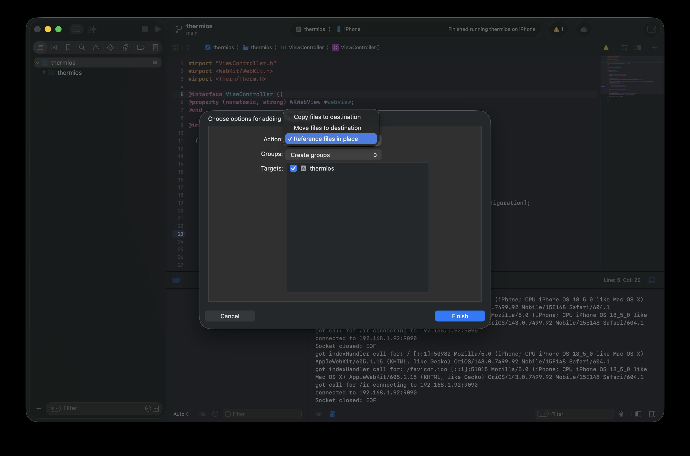

golang library for serving thermal data

basic web server to serve:
0. single-page-app / html
0. http --> socket proxy to infrared sensor

Via the go mobile project (https://github.com/golang/mobile) this library can be consumed in xcode. To build
the xcode consumable, run: 

`gomobile bind -target ios`

which will create a directory `Therm.xcframework` with headers and the binary. Drag and drop the directory into
the xcode client project, and select "Reference files in place":



To test the library apart from xcode, start a sensor (add) and then start the simple client:

```
go run main/main.go
```

This starts the webserver and waits for a keyboard interrupt (CTRL-C).

