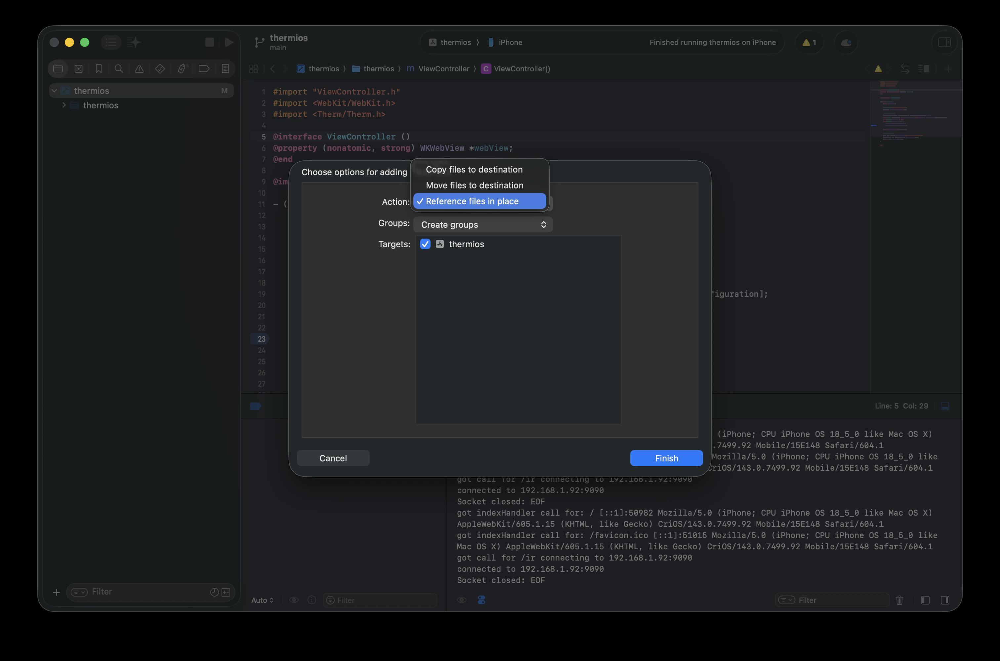

## golang library for serving thermal data

basic web server to serve:
1. single-page-app / html
1. http --> socket proxy to infrared sensor

## DEMOS
videos: 
  https://jmccaughey.github.io/therm/

"live" playbacks (with thermal data re-rendered from recording):
  https://jmccaughey.github.io/therm/app.html?recording=2026-01-22T17_58_03.065Z
  https://jmccaughey.github.io/therm/app.html?recording=2026-01-22T17_58_26.287Z


Via the go mobile project (https://github.com/golang/mobile) this library can run on iOS. To build
the xcode consumable, run: 

`gomobile bind -target ios`

which will create a directory `Therm.xcframework` with headers and the binary. Drag and drop the directory into
the xcode client project, and select "Reference files in place":



To test the library apart from xcode, start a sensor (add) and then start the simple client:

```
go run main/main.go
[OR]
go run main/main.go -host raspberrypi.local
```

This starts the webserver and waits for a keyboard interrupt (CTRL-C).

To confirm the stream of thermal data, 


To find hosts on your local wifi network:
`sudo nmap -sn -PR 192.168.1.0/24`
